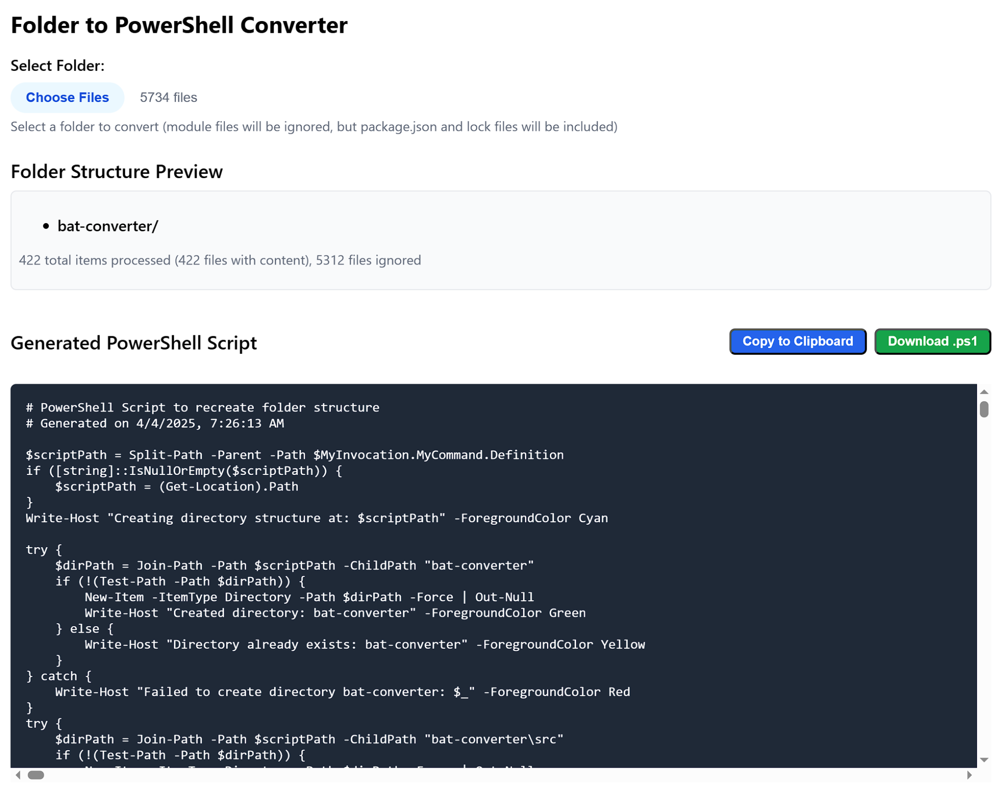

# PowerShell Folder/File Converter

## About:
Converts folders and files into a PowerShell script that recreates the directory structure and file contents.
The following filetypes are ignored to decreease file size and any dependencies may be installed post folder recreation

| Category | File Types |
|----------|------------|
| **Binary Files** | Executable (`.exe`), Dynamic Library (`.dll`), Object (`.obj`), Binary (`.bin`), Data (`.dat`), Program Database (`.pdb`), Shared Object (`.so`), Java Class (`.class`), Compiled Python (`.pyc`, `.pyo`), Images (`.jpg`, `.jpeg`, `.png`, `.gif`), Archives (`.zip`, `.tar`, `.gz`, `.7z`) |
| **Ignored Files** | Dynamic Library (`.dll`), PowerShell Script Definitions (`.psd1`), PowerShell Modules (`.psm1`), General Modules (`.module`), Compiled Python (`.pyc`), Solution User Options (`.suo`), User Settings (`.user`), Solution (`.sln`), Cache (`.cache`) |
| **Ignored Folders** | Node Modules (`node_modules/`), Modules (`modules/`), Python Cache (`__pycache__/`), Git (`.git/`), Binaries (`bin/`), Objects (`obj/`), Visual Studio (`.vs/`), VS Code (`.vscode/`) |
## Usage
1. Drag and drop folders/files into the tool.
2. A `.ps1` script is generated.
3. Run the script to restore the structure and contents.

